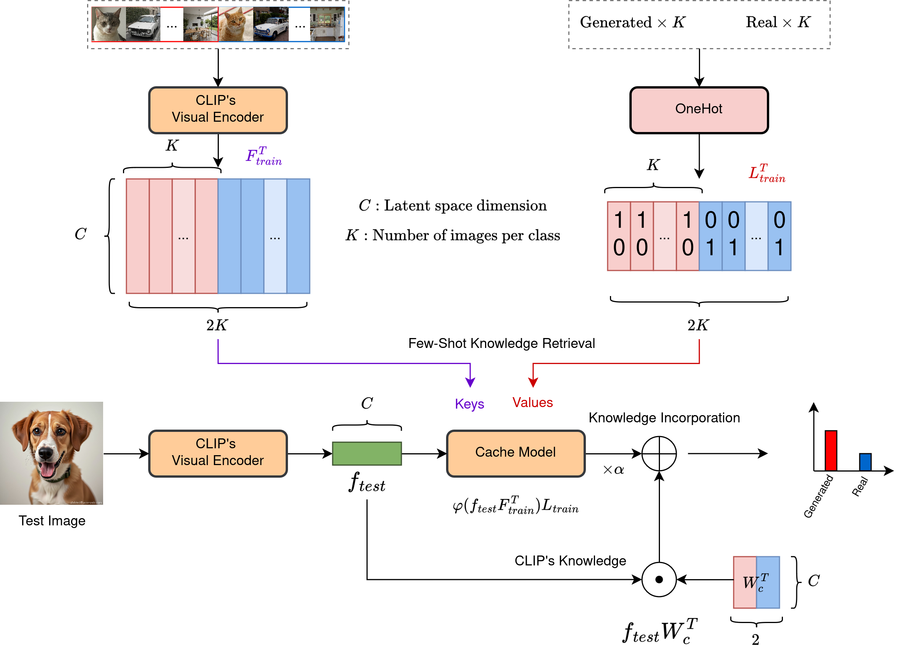

# Detection of AI-Generated Images
This project aims to detect AI-generated images using machine learning techniques.

In recent years, the creation of highly realistic synthetic images using AI has become increasingly prevalent. This project addresses the challenge of distinguishing between real and AI-generated images, which is crucial for maintaining trust in visual media and preventing the spread of misinformation.

The main idea explored was to use CLIP's image encoder to extract features from images and feed this features to a MLP neural network to perform classification between real and generated images.
We experimented on many different custom datasets. Experiments were run for multiclass classification where the classes were the generators used to produce the images or "null" if the image was real. We later focused on binary classification between real and generated images.

After experimenting a lot with linear probing, we decided to try other approaches and implemented Tip-Adapter to perform binary classification. Thus harnessing the power of the text encoder besides the image encoder. 

## Project Structure

src/: Contains the source code for the project 
src/model/: code and weights of the classifier, dataset class implementation and Tip Adapter code 
src/notebooks/: Jupyter notebooks for experimentation and analysis 
misc/: results obtain during the challenge and environment file 
docs/: report and results